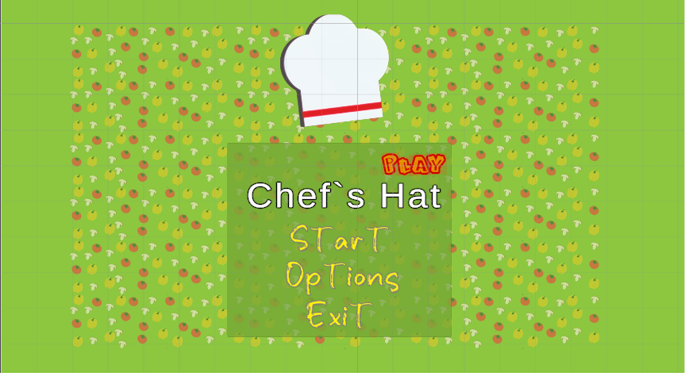
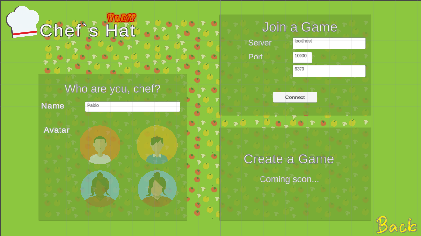

## Chef`s Hat Play

This repository holds the Chef`s Hat Play Unity Interface, which contains all the necessary tools to communicate with a Chef`s Hat Gym Server and allow a human to be one of the players.

With this interface, you will be able to:

* Connect to a Chef`s Hat Game room
* Play the game following all the original game rules
* Save all the actions you did using the standard Chef`s Hat Gym formats
* Allows one or more users to play the game against each other - or against artificial agents

[TODO] Full documentation can be found here: 

For more information about the Chef`s Hat Gym environment and an extensive list of existing plugins and libraries, please check the [Chef`s Hat Gym repository](https://github.com/pablovin/ChefsHatGYM)


## The Chef's Hat Card game

 

The Chef's Hat Environment provides a simple and easy-to-use API, based on the OpenAI GYM interface, for implementing, embedding, deploying, and evaluating reinforcement learning agents.

Fora a complete overview on the development of the game, refer to:

- It's Food Fight! Introducing the Chef's Hat Card Game for Affective-Aware HRI (https://arxiv.org/abs/2002.11458)
- You Were Always on My Mind: Introducing Chef’s Hat and COPPER for Personalized Reinforcement Learning (https://www.frontiersin.org/articles/10.3389/frobt.2021.669990/full)
- The Chef's Hat rulebook  [The Chef's Hat rulebook.](gitImages/RulebookMenuv08.pdf)

If you want to have access to the game materials (cards and playing field), please contact us using the contact information at the end of the page.


## Playing a Chef`s Hat interface

Currently, this is a Unity project. To run the interface, install Unity and load this project on it. 

To play the game, you have to first run a Chef`s Hat Game room remotely - even if you run it on your local machine, the game room must be run in a remote setting.
Once the room is running, the players have to be connected to the room. The Unity interface will act as one player.
After the room and the players are running, you can run the Unity Interface.

### Step 1: Run the remote room
A Chef`s Hat Gym room is a game server that waits for player`s connection via TCP. This means the room can be run and expect connections from players in a local machine, or via internet.

Follows a basic example of a remote room, running on your machine:

```python
from ChefsHatGym.gameRooms.chefs_hat_room_server import ChefsHatRoomServer
from ChefsHatGym.env import ChefsHatEnv


# Room parameters
room_name = "server_room1"
room_password = "password"
timeout_player_subscribers = 200  # In seconds
timeout_player_response = 5  # In seconds
verbose = True


# Game parameters
game_type = ChefsHatEnv.GAMETYPE["MATCHES"]
stop_criteria = 1
maxRounds = 1


# Create the room
room = ChefsHatRoomServer(
    room_name,
    room_pass=room_password,
    timeout_player_subscribers=timeout_player_subscribers,
    timeout_player_response=timeout_player_response,
    game_type=game_type,
    stop_criteria=stop_criteria,
    max_rounds=maxRounds,
    verbose=verbose,
    save_dataset=True,
    save_game_log=True,
)


```

For a more detailed example, check the [Chef`s Hat Gymexamples folder.](https://github.com/pablovin/ChefsHatGYM/tree/master/examples/remoteRoom)

### Step 2: Connect remote players with the room

Each Chef`s Hat game needs four players. For every non-human player, you have to run a remote agent and connect it to the Chef`s Hat Server you raised in the last step.

You can do this, by using the Remote Player`s structure:

```python
from ChefsHatGym.agents.agent_random import AgentRandon

room_pass = "password"
room_url = "localhost"
room_port = 10000


# Create the players
p1 = AgentRandon(name="01", verbose=True)
p2 = AgentRandon(name="02", verbose=True)
p3 = AgentRandon(name="03", verbose=True)
p4 = AgentRandon(name="04", verbose=True)

# Join agents

p1.joinGame(room_pass=room_pass, room_url=room_url, room_port=room_port)
p2.joinGame(room_pass=room_pass, room_url=room_url, room_port=room_port)
p3.joinGame(room_pass=room_pass, room_url=room_url, room_port=room_port)
# p4 will be the unity interface
```


If you want to run more than one Unity Interface, you have to remove the required number of remote players from this code.


### Step 3: Connect remote players with the room



Once the server is runing, and the artificial players are connected to the room, you can open the Chef`s Hat Player unity interface, and fill the important information. If you are running everything local, the server port and server url should be the same as the artificial agents:

```python
room_url = "localhost"
room_port = 10000
```


## Use and distribution policy

All the examples in this repository are distributed under a Non-Comercial license. If you use this environment, you have to agree with the following itens:

- To cite our associated references in any of your publication that make any use of these examples.
- To use the environment for research purpose only.
- To not provide the environment to any second parties.

## Citations

- Barros, P., Yalçın, Ö. N., Tanevska, A., & Sciutti, A. (2023). Incorporating rivalry in reinforcement learning for a competitive game. Neural Computing and Applications, 35(23), 16739-16752.

- Barros, P., & Sciutti, A. (2022). All by Myself: Learning individualized competitive behavior with a contrastive reinforcement learning optimization. Neural Networks, 150, 364-376.

- Barros, P., Yalçın, Ö. N., Tanevska, A., & Sciutti, A. (2022). Incorporating Rivalry in reinforcement learning for a competitive game. Neural Computing and Applications, 1-14.

- Barros, P., Tanevska, A., & Sciutti, A. (2021, January). Learning from learners: Adapting reinforcement learning agents to be competitive in a card game. In 2020 25th International Conference on Pattern Recognition (ICPR) (pp. 2716-2723). IEEE.

- Barros, P., Sciutti, A., Bloem, A. C., Hootsmans, I. M., Opheij, L. M., Toebosch, R. H., & Barakova, E. (2021, March). It's Food Fight! Designing the Chef's Hat Card Game for Affective-Aware HRI. In Companion of the 2021 ACM/IEEE International Conference on Human-Robot Interaction (pp. 524-528).

- Barros, P., Tanevska, A., Cruz, F., & Sciutti, A. (2020, October). Moody Learners-Explaining Competitive Behaviour of Reinforcement Learning Agents. In 2020 Joint IEEE 10th International Conference on Development and Learning and Epigenetic Robotics (ICDL-EpiRob) (pp. 1-8). IEEE.

- Barros, P., Sciutti, A., Bloem, A. C., Hootsmans, I. M., Opheij, L. M., Toebosch, R. H., & Barakova, E. (2021, March). It's food fight! Designing the chef's hat card game for affective-aware HRI. In Companion of the 2021 ACM/IEEE International Conference on Human-Robot Interaction (pp. 524-528).


## Contact

Pablo Barros - pablovin@gmail.com

- [Twitter](https://twitter.com/PBarros_br)
- [Google Scholar](https://scholar.google.com/citations?user=LU9tpkMAAAAJ)
